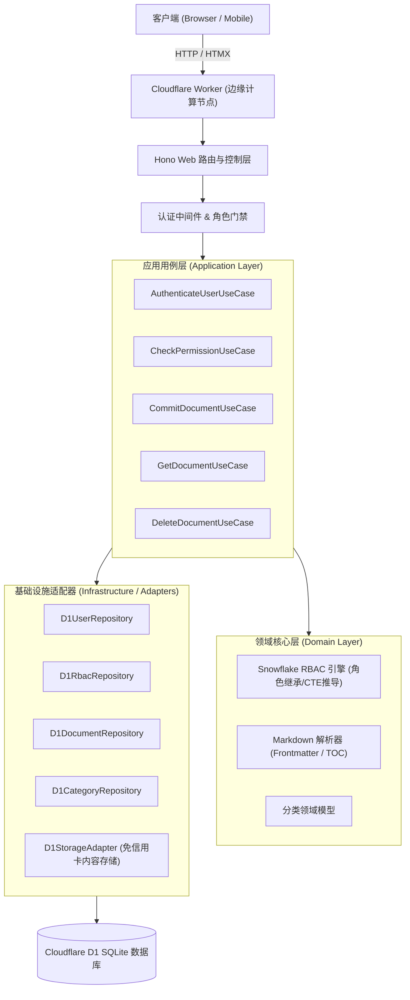

# mylog 开发者维护与 API 接口全景文档 (v1.0.0)

> 本文档面向系统的后续迭代、功能维护及二次开发，详细说明了系统架构、数据流转、数据库设计、全量 HTTP/HTMX 接口契约及运维部署指南。

---

## 目录
1. [系统整体架构与分层设计](#一系统整体架构与分层设计)
2. [数据模型与 Snowflake RBAC 设计](#二数据模型与-snowflake-rbac-设计)
3. [全量 API 接口契约文档](#三全量-api-接口契约文档)
   - 3.1 [认证与会话模块 (Auth & Session)](#31-认证与会话模块-auth--session)
   - 3.2 [文档知识库模块 (Documents & Reader)](#32-文档知识库模块-documents--reader)
   - 3.3 [分类系统模块 (Categories)](#33-分类系统模块-categories)
   - 3.4 [权限管理中心模块 (Admin RBAC)](#34-权限管理中心模块-admin-rbac)
4. [前端 Bento Box 设计系统与 HTMX 交互规范](#四前端-bento-box-设计系统与-htmx-交互规范)
5. [本地开发与 CI/CD 运维指南](#五本地开发与-cicd-运维指南)

---

## 一、系统整体架构与分层设计

本项目基于 **Cloudflare Workers** 边缘运行时构建，采用 **六边形架构 (Hexagonal Architecture / Ports & Adapters)** 与 **DDD (领域驱动设计)** 原则，实现了业务逻辑与基础设施层的完全解耦。

### 1.1 架构拓扑



### 1.2 目录结构说明

```text
mylog/
├── migrations/                # D1 关系型数据库增量迁移 SQL (0001-0005)
├── src/
│   ├── index.tsx              # 应用总入口：DI 依赖注入容器、中间件与总路由挂载
│   ├── core/                  # 核心基础类库
│   │   ├── event-bus.ts       # 全局轻量事件总线 (解耦文档增删与缓存/通知)
│   │   ├── result.ts          # 函数式 Result<T, E> 模式实现 (替代直接 throw)
│   │   └── types.ts           # 全局环境绑定 (Bindings)、Session 与 Context 定义
│   ├── modules/
│   │   ├── iam/               # 身份识别与访问管理模块 (Identity & Access Management)
│   │   │   ├── domain/        # RBAC 规则推导算法、角色/特权枚举类型
│   │   │   ├── ports/         # 仓储接口契约 (RbacRepositoryPort, UserRepositoryPort)
│   │   │   ├── application/   # 认证用例、权限校验用例
│   │   │   └── infrastructure/# D1 实现 (包含递归 CTE 鉴权算法) 与密码哈希器
│   │   └── document/          # 文档与知识库模块
│   │       ├── domain/        # Markdown 解析引擎、Frontmatter 提取、分类领域实体
│   │       ├── ports/         # 存储契约 (StoragePort)、文档仓储契约
│   │       ├── application/   # 文档提交、获取、预览与删除用例
│   │       └── infrastructure/# D1 文档仓储与 D1 文件内容存储适配器
│   └── web/                   # Web 交付层 (UI & Routes)
│       ├── routes/            # HTTP 路由处理程序 (Auth, File, Category, Admin RBAC)
│       ├── styles/            # Bento Box 视觉规范、CSS 设计 Tokens 与全局样式表
│       └── views/             # JSX 服务端渲染组件 (HTMX 局部组件与整页布局)
├── test/                      # 核心领域单元测试集 (Vitest)
├── .github/workflows/         # GitHub Actions 自动化 CI/CD 流水线配置
└── wrangler.toml              # Cloudflare Workers 部署配置文件
```

---

## 二、数据模型与 Snowflake RBAC 设计

系统完整实现了业界标杆 **Snowflake** 风格的访问控制架构：**特权的唯一承载体是角色（Role），用户仅通过持有角色间接拥有权限**。

### 2.1 实体关系模型 (ER 逻辑)

1. **User (用户)** ➔ 通过 `user_roles` 关联 **Role (角色)**；
2. **Role (角色)** ➔ 通过 `role_inheritance` 继承其他子角色（多级递归）；
3. **Privilege (特权: `READ` / `WRITE` / `DELETE` / `OWNERSHIP`)** ➔ 通过 `grants` 授予 **Role** 在特定 **Securable Object (文档)** 上的访问能力；
4. **Securable Object (可安全对象)** ➔ 绑定在 `files` 表上，且每个对象天然拥有一个属主角色 (`owner_role_id`)；
5. **File Content (内容)** ➔ 保存在 `file_contents` 表中，完全解耦存储媒介。

### 2.2 核心数据库表结构

#### 1. `users`（用户表）
| 字段名 | 类型 | 约束 | 描述 |
| :--- | :--- | :--- | :--- |
| `id` | TEXT | PRIMARY KEY | 用户唯一标识，如 `usr_xxxx` |
| `username` | TEXT | UNIQUE, NOT NULL | 唯一登录名 |
| `password_hash` | TEXT | NOT NULL | 基于 SHA-256 + Salt 的单向散列值 |
| `is_active` | INTEGER | NOT NULL DEFAULT 1 | 账户启用状态 |
| `created_at` | INTEGER | NOT NULL | 注册时间戳 (ms) |

#### 2. `roles`（角色表）
| 字段名 | 类型 | 约束 | 描述 |
| :--- | :--- | :--- | :--- |
| `id` | TEXT | PRIMARY KEY | 角色唯一标识，如 `rol_accountadmin` |
| `name` | TEXT | UNIQUE, NOT NULL | 角色代码 (如 `ACCOUNTADMIN`, `ROLE_USER`) |
| `description` | TEXT | NULLABLE | 角色职能说明 |
| `is_system` | INTEGER | NOT NULL DEFAULT 0 | 是否为系统内置只读角色 |
| `created_at` | INTEGER | NOT NULL | 创建时间戳 (ms) |

#### 3. `user_roles`（用户-角色映射表）
| 字段名 | 类型 | 约束 | 描述 |
| :--- | :--- | :--- | :--- |
| `user_id` | TEXT | REFERENCES users(id) | 用户 ID |
| `role_id` | TEXT | REFERENCES roles(id) | 角色 ID |
| `granted_by` | TEXT | NOT NULL | 授权操作人 ID 或 `SYSTEM` |
| `granted_at` | INTEGER | NOT NULL | 授权时间戳 |
| **PRIMARY KEY** | `(user_id, role_id)` | | 复合主键 |

#### 4. `grants`（特权授权矩阵）
| 字段名 | 类型 | 约束 | 描述 |
| :--- | :--- | :--- | :--- |
| `id` | TEXT | PRIMARY KEY | 授权记录唯一 ID |
| `role_id` | TEXT | REFERENCES roles(id) | 被授予权限的角色 |
| `object_id` | TEXT | REFERENCES files(id) | 目标文档 ID |
| `privilege` | TEXT | NOT NULL | `READ` \| `WRITE` \| `DELETE` \| `OWNERSHIP` |
| `granted_by` | TEXT | REFERENCES users(id) | 授权执行人 |
| `granted_at` | INTEGER | NOT NULL | 授权时间戳 |

#### 5. `files` 与 `file_contents`（文档元数据与正文表）
```sql
-- 5.1 文档元数据
CREATE TABLE files (
  id TEXT PRIMARY KEY,
  name TEXT NOT NULL,
  title TEXT,
  size INTEGER NOT NULL,
  r2_key TEXT UNIQUE NOT NULL,
  sha256 TEXT NOT NULL,
  category_id TEXT DEFAULT 'cat_uncategorized',
  views_count INTEGER DEFAULT 0,
  is_public INTEGER NOT NULL DEFAULT 0,
  created_at INTEGER NOT NULL,
  updated_at INTEGER NOT NULL
);

-- 5.2 正文内容 (替代 R2，免除信用卡)
CREATE TABLE file_contents (
  key TEXT PRIMARY KEY,
  content TEXT NOT NULL,
  updated_at INTEGER NOT NULL
);
```

### 2.3 权限决策推导算法 (CTE 递归)

鉴权查询在数据库层执行一条高效的 **递归公共表达式 (Recursive CTE)**，自动展开角色继承树：

```sql
WITH RECURSIVE user_effective_roles AS (
  -- 1. 直接被授予该用户的角色
  SELECT role_id FROM user_roles WHERE user_id = ?
  UNION
  -- 2. 递归查找这些角色通过继承链向下继承的全部有效角色
  SELECT ri.child_role_id
  FROM role_inheritance ri
  JOIN user_effective_roles uer ON ri.parent_role_id = uer.role_id
)
SELECT 1 AS allowed
FROM grants g
WHERE g.object_id = ?
  AND (g.privilege = ? OR g.privilege = 'OWNERSHIP')
  AND g.role_id IN (SELECT role_id FROM user_effective_roles)
UNION
-- 3. 若文档设置了 is_public = 1，则所有人的 READ 请求天然允许
SELECT 1 AS allowed
FROM files f
WHERE f.id = ? AND f.is_public = 1 AND ? = 'READ'
LIMIT 1;
```

---

## 三、全量 API 接口契约文档

> 接口类型说明：
> - **标准页面/重定向**：返回整页 HTML 或 302 重定向；
> - **HTMX 局部组件**：专门为前端 HTMX 设计的无刷新局部 HTML 片段。

### 3.1 认证与会话模块 (Auth & Session)

#### 1. 渲染登录页面
- **请求方式**：`GET /login`
- **权限需求**：公开（未登录）
- **响应**：整页 HTML (`AuthPage`)

#### 2. 渲染注册页面
- **请求方式**：`GET /register`
- **权限需求**：公开（未登录）
- **响应**：整页 HTML (`AuthPage` 切换至注册标签)

#### 3. 用户登录
- **请求方式**：`POST /login`
- **请求格式**：`application/x-www-form-urlencoded`
- **参数**：
  | 参数名 | 类型 | 必填 | 校验说明 |
  | :--- | :--- | :--- | :--- |
  | `username` | string | 是 | 用户名（大小写不敏感，自动转小写） |
  | `password` | string | 是 | 密码文本 |
- **响应状态**：
  - 成功：`302 Found`，并在 Header 设置 `Set-Cookie: mylog_session=ses_xxx; Path=/; HttpOnly; SameSite=Lax`，重定向至 `/`；
  - 失败：`400 Bad Request`，重新渲染登录页并展示红色错误告警。

#### 4. 用户注册
- **请求方式**：`POST /register`
- **请求格式**：`application/x-www-form-urlencoded`
- **参数**：
  | 参数名 | 类型 | 必填 | 校验说明 |
  | :--- | :--- | :--- | :--- |
  | `username` | string | 是 | 用户名，长度需在 3 ~ 24 位之间 |
  | `password` | string | 是 | 密码，长度不能少于 6 位 |
- **业务行为**：
  1. 创建系统用户；
  2. 为新用户创建并赋予专属私有角色 `rol_user_<uid>`；
  3. 为新用户默认赋予普通用户基础角色 `rol_user` (无管理权限)；
  4. 签发 Session 并完成自动登录。
- **响应状态**：`302 Found` 重定向至 `/`。

#### 5. 安全登出
- **请求方式**：`GET /logout`
- **业务行为**：注销 D1 中的会话记录，清除客户端 `mylog_session` Cookie。
- **响应状态**：`302 Found` 重定向至 `/login`。

---

### 3.2 文档知识库模块 (Documents & Reader)

#### 1. 知识库主页 (Bento 大厅)
- **请求方式**：`GET /`
- **Query 参数**：
  | 参数名 | 类型 | 选填 | 描述 |
  | :--- | :--- | :--- | :--- |
  | `cat` | string | 选填 | 分类 ID，用于过滤指定分类文档 |
  | `sort` | string | 选填 | `newest` (默认) 或 `views` (点击率最高) |
  | `q` | string | 选填 | 搜索关键词 |
- **响应**：整页 HTML (`DriveView`)。

#### 2. 文档网格局部搜索/筛选 (HTMX)
- **请求方式**：`GET /files`
- **Query 参数**：`cat`、`sort`、`q`
- **响应**：局部 HTML (`<div class="bento-files-grid">...</div>`)，无刷新替换 `#file-grid-container`。

#### 3. 获取上传模态框 (HTMX)
- **请求方式**：`GET /files/upload-modal`
- **响应**：局部 HTML (`UploadModal`)，注入 `#modal-container`。

#### 4. 实时解析与预览文档 (HTMX)
- **请求方式**：`POST /files/preview`
- **请求格式**：`multipart/form-data`
- **参数**：
  | 参数名 | 类型 | 必填 | 描述 |
  | :--- | :--- | :--- | :--- |
  | `file` | File | 是 | 上传的 `.md` / `.markdown` 文件对象 |
- **响应**：局部 HTML，返回提取后的 Frontmatter 元数据、预计阅读时间、标签云与目录结构。

#### 5. 确认提交持久化文档 (HTMX)
- **请求方式**：`POST /files/confirm`
- **请求格式**：`multipart/form-data`
- **参数**：
  | 参数名 | 类型 | 必填 | 描述 |
  | :--- | :--- | :--- | :--- |
  | `file` | File | 是 | 原文件对象 |
  | `categoryId` | string | 否 | 所属分类 ID，未选择则默认为 `cat_uncategorized` |
  | `isPublic` | string | 否 | `"1"` 代表所有人可读，`"0"` 代表私有文档 |
- **业务行为**：
  1. 将文件正文写入 `file_contents`；
  2. 将元数据写入 `files` 和 `securable_objects`；
  3. **赋予所有权**：若为登录用户，自动为当前用户的私有角色写入 `OWNERSHIP` 特权；若为未登录游客，归属于公共系统角色。
- **响应**：返回成功的通知与更新后的文档网格局部 HTML。

#### 6. 沉浸式阅读文档 (Reader Mode)
- **请求方式**：`GET /files/:id`
- **权限需求**：
  - 若文档为公开 (`is_public = 1`)，未登录游客可直接阅读；
  - 若为私有，需校验当前用户的角色是否具备 `READ` 或 `OWNERSHIP` 特权（未登录重定向至登录页，越权返回 403）。
- **业务行为**：正文提取渲染，并在 `files` 表中将 `views_count` 自动自增 1。
- **响应**：整页 HTML (沉浸式阅读排版，含代码高亮、浮动目录与属主操作条)。

#### 7. 删除文档
- **请求方式**：`DELETE /files/:id`
- **权限需求**：必须持有该文档的 `DELETE` 或 `OWNERSHIP` 特权。
- **业务行为**：同时清理 `files`、`file_contents`、`grants` 与 `securable_objects`。
- **响应**：`200 OK`，HTMX 自动在主页移除该卡片节点。

---

### 3.3 分类系统模块 (Categories)

#### 1. 列出分类体系
- **请求方式**：`GET /categories`
- **响应**：返回完整的两级分类树（包含一级分类及其 `children` 列表）。

#### 2. 新增分类
- **请求方式**：`POST /categories`
- **权限需求**：已登录用户
- **参数**：
  | 参数名 | 类型 | 必填 | 描述 |
  | :--- | :--- | :--- | :--- |
  | `name` | string | 是 | 分类名称（如 “前端工程”） |
  | `parentId` | string | 否 | 上级分类 ID（若为空则创建为一级分类） |
- **响应**：`200 OK` 并返回刷新后的分类胶囊导航栏。

---

### 3.4 权限管理中心模块 (Admin RBAC)

> ⚠️ **核心安全门禁**：
> `/admin/*` 下的所有路由均受严格中间件拦截：
> 1. 未登录访客 ➔ **302 Found** 重定向至 `/login`；
> 2. 已登录但非管理员（角色不包含 `rol_accountadmin`） ➔ 直接返回 **403 Forbidden 告警页**。

#### 1. 权限中心主看板
- **请求方式**：`GET /admin/rbac`
- **权限需求**：`ACCOUNTADMIN` 角色
- **响应**：整页 HTML (`RbacDashboardView`)，包含特权授予器、特权诊断模拟器、用户角色分配管理、特权授权矩阵与角色定义表。

#### 2. 为角色授予文档特权 (GRANT TO ROLE)
- **请求方式**：`POST /admin/rbac/grant`
- **参数**：
  | 参数名 | 类型 | 必填 | 描述 |
  | :--- | :--- | :--- | :--- |
  | `objectId` | string | 是 | 目标文档 ID (`file_xxxx`) |
  | `roleId` | string | 是 | 被授权的角色 ID (`rol_xxxx`) |
  | `privilege` | string | 是 | `READ` \| `WRITE` \| `DELETE` |
- **响应**：局部 HTML (`GrantsTable`)，无刷新替换 `#grants-matrix-container`。

#### 3. 撤销角色特权 (REVOKE)
- **请求方式**：`POST /admin/rbac/revoke`
- **参数**：`grantId` (授权记录 ID)
- **响应**：局部 HTML (`GrantsTable`)。

#### 4. 实时特权推导诊断模拟器 (Simulator)
- **请求方式**：`POST /admin/rbac/test`
- **参数**：
  | 参数名 | 类型 | 必填 | 描述 |
  | :--- | :--- | :--- | :--- |
  | `userId` | string | 是 | 模拟测试的用户 ID |
  | `objectId` | string | 是 | 目标文档 ID |
- **业务行为**：执行 CTE 递归展开用户的直接角色、继承角色，并求值其最终在目标文档上的 `READ` / `WRITE` / `DELETE` / `OWNERSHIP` 决策结果。
- **响应**：局部 HTML (`DiagnosticResult`)，输出四象限权限卡片。

#### 5. 为用户分配系统角色 (GRANT ROLE TO USER)
- **请求方式**：`POST /admin/rbac/user-role/assign`
- **参数**：
  | 参数名 | 类型 | 必填 | 描述 |
  | :--- | :--- | :--- | :--- |
  | `userId` | string | 是 | 被授权的目标用户 ID |
  | `roleId` | string | 是 | 要赋予的角色 ID (如 `rol_accountadmin` / `rol_user`) |
- **业务行为**：在 `user_roles` 插入关联，分配后该用户即时享有该角色的全部系统权限。
- **响应**：局部 HTML (`UserRolesTable`)，更新用户角色列表。

#### 6. 收回用户角色 (REVOKE ROLE FROM USER)
- **请求方式**：`POST /admin/rbac/user-role/revoke`
- **参数**：`userId`、`roleId`
- **内置安全保护**：禁止管理员在界面中撤销自己的 `rol_accountadmin` 角色，防止产生死锁。
- **响应**：局部 HTML (`UserRolesTable`)。

---

## 四、前端 Bento Box 设计系统与 HTMX 交互规范

系统全面摒弃了传统后台生硬的侧边栏设计，采用现代流行的 **Mobile-First Bento Box**（便当盒网格）响应式美学。

### 4.1 设计 Tokens 与核心 CSS 变量

定义位于 [src/web/styles/css.ts](file:///home/fx/Develop/mylog/src/web/styles/css.ts)：

| 变量名 | 默认值 (Dark 模式) | 作用场景 |
| :--- | :--- | :--- |
| `--bg-base` | `#090d16` (极夜黑) | 全局背景底色 |
| `--bg-surface` | `rgba(20, 26, 40, 0.75)` | Bento 卡片背景 (带高斯模糊) |
| `--accent-primary` | `#0ea5e9` (天青蓝) | 品牌主色、主交互按钮 |
| `--accent-flame` | `#f97316` (火焰橙) | 品牌 Logo 高光、管理员角标 |
| `--border-subtle` | `rgba(255, 255, 255, 0.08)` | 极细卡片描边 |
| `--radius-bento` | `20px` | Bento 卡片平滑大圆角 |

### 4.2 Bento 网格排版与卡片尺寸策略

文档列表采用不对称的动态卡片设计，让知识流生动灵动：
- **Hero 大卡片**（占满 2 列）：自动分配给“置顶”、“点击量最高”或“最新创建”的旗舰文档，提供沉浸式阅读引导；
- **Wide 横卡片**（横向延伸）：适用于标题较长或摘要丰富的文档；
- **Square 方形卡片**（标准便当）：展示精炼的速记、代码片段或常规文档。

### 4.3 HTMX 异步无刷新开发规范

所有交互均遵循“后端返回 HTML 片段，前端自动局部替换”的极速体验：
```html
<!-- 示例：搜索防抖与包含关联过滤参数 -->
<input
  id="file-search-input"
  type="search"
  name="q"
  hx-get="/files"
  hx-trigger="keyup changed delay:250ms, search"
  hx-target="#file-grid-container"
  hx-include="#current-category-id, #current-sort-id"
  hx-swap="innerHTML"
/>
```

---

## 五、本地开发与 CI/CD 运维指南

### 5.1 本地常用命令

```bash
# 1. 启动本地边缘开发服务器 (默认端口 8787)
npm run dev

# 2. 执行 TypeScript 静态类型安全检查
npm run build

# 3. 运行 Snowflake RBAC 核心引擎单元测试
npm test

# 4. 对本地 D1 SQLite 数据库执行数据迁移
npm run d1:migrate:local
```

### 5.2 生产环境初始化：添加第一个超级管理员

当远程 Cloudflare D1 数据库首次建好后，线上没有任何超级管理员：
1. 访问线上站点注册您的主账号（例如 `fanxiao`）；
2. 在本地项目根目录下执行以下命令，直接向线上注入管理员角色：

```bash
npx wrangler d1 execute DB --remote --command "INSERT OR IGNORE INTO user_roles (user_id, role_id, granted_by, granted_at) SELECT id, 'rol_accountadmin', 'SYSTEM', strftime('%s', 'now') * 1000 FROM users WHERE username = 'fanxiao';"
```

### 5.3 GitHub Actions CI/CD 流程维护

配置文件位于 [.github/workflows/deploy.yml](file:///home/fx/Develop/mylog/.github/workflows/deploy.yml)。

在 GitHub 仓库需配置两个 Secrets（路径：`Settings -> Secrets and variables -> Actions`）：
1. `CLOUDFLARE_API_TOKEN`：需具备 **Workers Scripts: Edit** 与 **D1: Edit** 权限；
2. `CLOUDFLARE_ACCOUNT_ID`：您的 Cloudflare 账户 ID。

任何合并或推送到 `main` 分支的代码，流水线将自动运行：
`npm ci` ➔ `npm run build` ➔ `npm test` ➔ `wrangler d1 migrations apply DB --remote` ➔ `wrangler deploy`，全自动安全上线。

---

*文档版本：v1.0.0*  
*更新日期：2026-09-22*  
*维护者：fanxiao / mylog 架构组*
