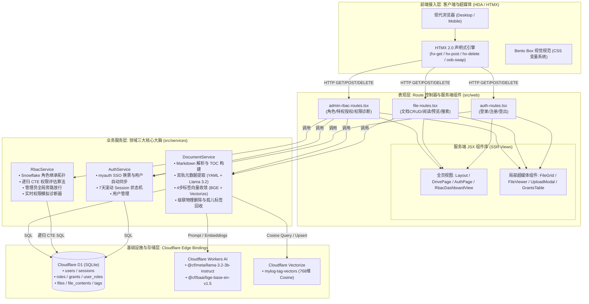
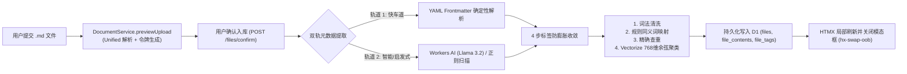
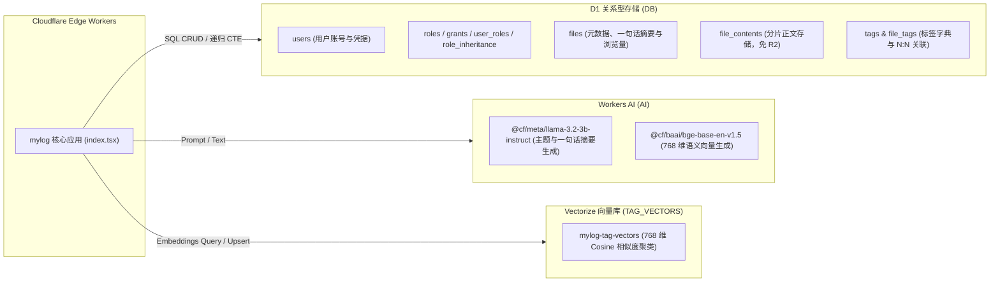
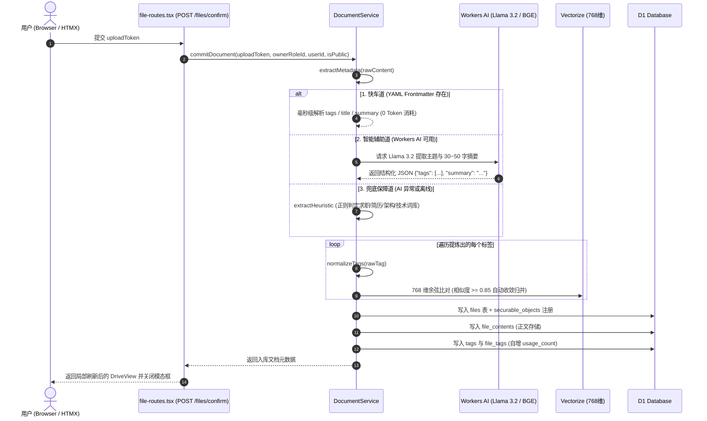
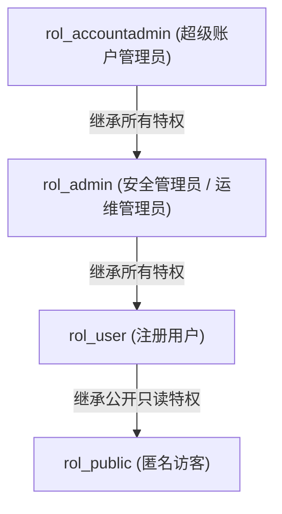

# mylog 核心架构设计、代码阅读向导与业务排障指南 (v2.0.0)

> 本文档面向系统维护者、架构师及二次开发者，系统化阐述 `mylog` 从过度设计 DDD 向 **经典三层服务架构（Route ➔ Service ➔ Database）** 与 **超媒体驱动架构（HDA / HTMX + SSR JSX）** 实用主义重构后的全景设计。提供详尽的 **全局架构导图**、**15 分钟极速代码阅读向导**，以及 **1 分钟线上故障秒级定位手册**。

---

## 目录
1. [系统全景与技术栈总览](#一系统全景与技术栈总览)
2. [全局系统导图与经典三层架构](#二全局系统导图与经典三层架构)
   - 2.1 [端到端全局系统架构导图 (Mermaid 全景)](#21-端到端全局系统架构导图)
   - 2.2 [核心业务数据流转与生命周期拓扑](#22-核心业务数据流转与生命周期拓扑)
3. [开发者代码阅读向导 (15 分钟速读指南)](#三开发者代码阅读向导-15-分钟速读指南)
   - 3.1 [工程目录全景 (精炼 18 文件清单)](#31-工程目录全景-精炼-18-文件清单)
   - 3.2 [新手极速上手与五步精读路径](#32-新手极速上手与五步精读路径)
   - 3.3 [四大核心业务流代码穿透追踪指引](#33-四大核心业务流代码穿透追踪指引)
4. [边缘数据基础设施三驾马车 (D1 + Vectorize + Workers AI)](#四边缘数据基础设施三驾马车-d1--vectorize--workers-ai)
   - 4.1 [D1 关系型存储结构与实体关系](#41-d1-关系型存储结构与实体关系)
   - 4.2 [Workers AI 边缘智能模型配置](#42-workers-ai-边缘智能模型配置)
   - 4.3 [Vectorize 768 维向量聚类索引规范](#43-vectorize-768-维向量聚类索引规范)
5. [核心业务生命周期与数据链路](#五核心业务生命周期与数据链路)
   - 5.1 [文档摄取与双轨元数据提取 (Frontmatter + Workers AI + 启发式)](#51-文档摄取与双轨元数据提取)
   - 5.2 [四步标签防膨胀收敛引擎 (Anti-Tag-Explosion Engine)](#52-四步标签防膨胀收敛引擎)
   - 5.3 [单篇沉浸阅读与浏览量原子自增](#53-单篇沉浸阅读与浏览量原子自增)
   - 5.4 [文档物理删除与级联清理孤儿标签](#54-文档物理删除与级联清理孤儿标签)
6. [Snowflake RBAC 权限体系与递归 CTE 算法](#六snowflake-rbac-权限体系与递归-cte-算法)
   - 6.1 [多角色继承拓扑图谱](#61-多角色继承拓扑图谱)
   - 6.2 [递归 CTE 单 SQL 权限推导与超级管理员旁路](#62-递归-cte-单-sql-权限推导与超级管理员旁路)
7. [超媒体驱动架构 (HDA / HTMX) 与服务端组件化 MVC](#七超媒体驱动架构-hda--htmx-与服务端组件化-mvc)
   - 7.1 [HDA 超媒体驱动架构交互哲学](#71-hda-超媒体驱动架构交互哲学)
   - 7.2 [全页渲染与 HTMX 局部刷新精准分离](#72-全页渲染与-htmx-局部刷新精准分离)
8. [全量 HTTP/HTMX 接口契约清单](#八全量-httphttps-接口契约清单)
9. [极速故障定位与排障手册 (Troubleshooting Playbook)](#九极速故障定位与排障手册-troubleshooting-playbook)
   - 9.1 [三步故障定位法 (Three-Step Diagnostic)](#91-三步故障定位法)
   - 9.2 [全栈健康诊断探针 (`/api/health-infra`)](#92-全栈健康诊断探针)
   - 9.3 [十大常见故障与秒级修复方案 (Known Traps & Fixes)](#93-十大常见故障与秒级修复方案)

---

## 一、系统全景与技术栈总览

`mylog` 是一套完全基于 **Cloudflare 边缘全球计算网格 (Workers Ecosystem)** 构建的高性能个人知识库与技术文档中心。项目摒弃传统的单体服务器、臃肿框架与外部对象存储账单，利用 Cloudflare 免费配额实现了 **0 外部云依赖、0 信用卡绑定、极速冷启动** 的现代化边缘 Web 应用。

### 核心技术栈矩阵

| 维度 | 选型技术 | 核心职责与优势 |
| :--- | :--- | :--- |
| **运行时 (Runtime)** | Cloudflare Workers (V8 Isolates) | 全球 300+ 边缘节点毫秒级就近响应 (<5ms 冷启动) |
| **Web 框架** | Hono v4 + JSX (SSR) | 轻量型极速 Web 路由，边缘端服务端流式渲染 HTML/JSX 片段 |
| **前端交互** | HTMX v2.0 + 原生 Vanilla CSS | 声明式超媒体驱动 (HTML-over-the-wire)，0KB 客户端业务 JS |
| **关系型主数据库** | Cloudflare D1 (SQLite at the edge) | 存储用户、会话、RBAC 关系拓扑、文档元数据、标签与正文 |
| **向量数据库** | Cloudflare Vectorize | 768 维 Cosine 向量检索，用于标签语义聚类与防膨胀收敛 |
| **边缘智能认知** | Cloudflare Workers AI | 运行 Llama 3.2 3B 文本理解与 BAAI BGE 768 维多语言语义嵌入 |
| **权限控制模型** | Snowflake 风格的 RBAC | 支持多角色继承有向图、单条递归 CTE 快速推导与细粒度特权控制 |

---

## 二、全局系统导图与经典三层架构

项目历经重构，彻底摒弃了包含 20+ 抽象层、大量 Port 接口和胶水 UseCase 的重型 Hexagonal DDD 模式，全面收敛为清晰、可维护、高内聚的 **经典三层服务架构（Route ➔ Service ➔ Database）**。

### 2.1 端到端全局系统架构导图



### 2.2 核心业务数据流转与生命周期拓扑



---

## 三、开发者代码阅读向导 (15 分钟速读指南)

### 3.1 工程目录全景 (精炼 18 文件清单)

经过重构后的完整工程仅由 **18 个源码文件** 组成，结构高度正交，无任何冗余垃圾代码：

```text
src/
├── core/
│   └── types.ts                    # [Model] 全局强类型契约 (Bindings, Session, FileMetadata, Rbac)
├── index.tsx                       # [Entry] 全局应用入口、依赖注入 (DI Container)、CSS分发与健康探针
├── services/                       # [Service] 业务服务层 (系统 3 大核心大脑)
│   ├── auth-service.ts             # 1. 认证服务 (SSO 用户同步、Session 快速验证与注销)
│   ├── rbac-service.ts             # 2. 权限服务 (Snowflake 递归 CTE、特权矩阵、模拟诊断)
│   └── document-service.ts         # 3. 文档服务 (CRUD、双轨元数据、4步向量收敛、孤儿标签清理)
└── web/                            # [Presentation] Web 展现层
    ├── middleware/
    │   ├── auth-middleware.ts      # 认证拦截守卫 (requireAuth)
    │   └── edge-auth-guard.ts      # myauth SSO 边缘认证换票与全域会话守卫
    ├── routes/                     # [Route] 控制器层 (无业务逻辑，负责请求解析与渲染分发)
    │   ├── auth-routes.tsx         # 登录引导、SSO换票回调、登出路由
    │   ├── file-routes.tsx         # 文档大盘、搜索、阅读、上传预览、删除路由
    │   └── admin-rbac-routes.tsx   # RBAC 权限大盘、授权撤回、特权模拟器路由
    ├── styles/                     # [Style] Bento Box 视觉系统
    │   ├── css.ts                  # 嵌入式 CSS 变量规范 (MAIN_CSS)
    │   └── main.css                # 静态样式主文件
    └── views/                      # [View] 服务端纯函数式 JSX 组件库
        ├── layout.tsx              # 顶层响应式 HTML 骨架 (加载 HTMX 与 CSS)
        ├── drive-view.tsx          # 知识库网盘全页视图 (DrivePage) 与大盘视图 (DriveView)
        ├── admin/
        │   └── RbacDashboardView.tsx # RBAC 控制台全页视图、特权表格与角色表格
        └── components/
            ├── FileGrid.tsx        # 文档 Bento 卡片网格局部组件 (带删除、分享、阅读)
            ├── FileViewer.tsx      # Markdown 沉浸式阅读器与粘性 TOC 目录
            └── UploadModal.tsx     # 上传模态框与即时排版预览卡片 (UploadPreviewCard)
```

### 3.2 新手极速上手与五步精读路径

新加入的开发者或二次开发同学，推荐按以下次序在 15 分钟内通读核心链路：

```text
  第 1 步: 阅读 src/core/types.ts ─────────▶ 理解系统的数据模型契约与 Bindings
     │
  第 2 步: 阅读 src/index.tsx ─────────────▶ 掌握请求生命周期、服务依赖注入与中间件管道
     │
  第 3 步: 研读 src/services/ ─────────────▶ 核心大脑：聚焦 document-service.ts 与 rbac-service.ts
     │
  第 4 步: 查看 src/web/routes/ ───────────▶ 了解控制器如何获取 Service 并响应超媒体请求
     │
  第 5 步: 浏览 src/web/views/ ────────────▶ 理解服务端 JSX 组件拆分与 HTMX 属性声明 (hx-get / hx-target)
```

### 3.3 四大核心业务流代码穿透追踪指引

| 业务场景 | 代码追踪入口 (Route) | 业务处理大脑 (Service) | 持久化与算法执行 (Database & Infra) |
| :--- | :--- | :--- | :--- |
| **① 首页搜索与实时防抖** | `file-routes.tsx` (`GET /files?q=...`) | `DocumentService.search` | D1 SQL (`LIKE` / 标签过滤 / 浏览量降序) ➔ 返回 `<FileGrid />` 片段 |
| **② 文档上传与双轨收敛** | `file-routes.tsx` (`POST /files/confirm`) | `DocumentService.commitDocument` | 1. YAML / Llama 3.2 提取元数据<br>2. BGE 向量生成 + Vectorize 余弦比对<br>3. D1 事务写入 `files`, `file_contents`, `file_tags` |
| **③ 文档物理删除与孤儿清理**| `file-routes.tsx` (`DELETE /files/:id`) | `DocumentService.deleteDocument` | 1. `RbacService.hasPrivilege` 校验删除权限<br>2. D1 物理删除文档记录<br>3. `orphanTagCleanup` 自动清理无引用孤儿标签 |
| **④ RBAC 权限求值与诊断** | `admin-rbac-routes.tsx` (`POST /admin/rbac/test`) | `RbacService.diagnosePrivileges` | 单条递归 CTE 展开角色继承树 ➔ 评估对象授权与超级管理员旁路放行 |

---

## 四、边缘数据基础设施三驾马车 (D1 + Vectorize + Workers AI)

系统将 Cloudflare 的三项核心边缘服务通过 `wrangler.toml` 绑定并协同运作：



### 4.1 D1 关系型存储结构与实体关系

数据库共包含 10 张核心关系表：

1. **`users`**：存储用户账号、基础信息与状态（凭据由统一中心 myauth 管控，本地不存密）；
2. **`roles`**：系统与自定义角色定义（包含 `rol_accountadmin`, `rol_admin`, `rol_user`, `rol_public`）；
3. **`user_roles`**：用户与角色的多对多绑定；
4. **`role_inheritance`**：角色继承父子拓扑有向图（支持多层传递）；
5. **`grants`**：细粒度授权表（`role_id` + `object_id` + `privilege`）；
6. **`categories`**：分类扩展定义表；
7. **`files`**：文档元数据，包含 `title`, `r2_key`, `views`, `ai_summary`, `owner_role_id`, `is_public`；
8. **`file_contents`**：存储原始 Markdown 文本（作为无信用卡绑定时的存储适配方案，取代 AWS S3/R2）；
9. **`tags`**：全局标签主字典表，包含 `id`, `name`, `canonical_id` (别名重定向), `usage_count` (引用计数)；
10. **`file_tags`**：文档与标签的高效 N:N 联合索引表（带级联删除 `ON DELETE CASCADE`）。

### 4.2 Workers AI 边缘智能模型配置

在 `wrangler.toml` 中通过 `[ai] binding = "AI"` 绑定：
- **语义嵌入模型**：`@cf/baai/bge-base-en-v1.5`
  - 输出维度：**768 维** Float32 向量；
  - 特性：兼具极佳的中文与英文多语言语义表征能力，专用于标签语义聚类与防膨胀。
- **结构化生成模型**：`@cf/meta/llama-3.2-3b-instruct` (主力) / `@cf/meta/llama-3.1-8b-instruct-fp8` (备用)
  - 任务：根据文档前 1500 字内容，提取文档本质主题标签与 30~50 字精炼摘要。

### 4.3 Vectorize 768 维向量聚类索引规范

在 `wrangler.toml` 中配置：
```toml
[[vectorize]]
binding = "TAG_VECTORS"
index_name = "mylog-tag-vectors"
```
- **维度 (Dimensions)**：`768`；
- **度量算法 (Metric)**：`Cosine (余弦相似度)`；
- **异步写入特性**：调用 `TAG_VECTORS.upsert()` 后立即返回 `{ mutationId: string }`，底层由 Cloudflare 异步排队入库，30~60 秒内后台构建索引完成。

---

## 五、核心业务生命周期与数据链路

### 5.1 文档摄取与双轨元数据提取

当用户提交 Markdown 文件时，由 `DocumentService` 协调执行双轨元数据提取：



### 5.2 四步标签防膨胀收敛引擎

知识库随着时间推移极易产生标签碎片化（如 `k8s`、`Kubernetes`、`k8s运维` 混杂）。系统在 `DocumentService` 内置了 **四级漏斗过滤法** 实现全自动收敛：

```mermaid
graph TD
    InputTag["原始输入标签 (例: '#TypeScript_2026')"] --> Step1["第 1 步: 词法清洗 (cleanLexical)<br/>剥离 #, 空格/下划线转中横线, 转小写, 截断30字"]
    Step1 -->|得到 'typescript-2026'| Step2{"第 2 步: 权威别名快速字典 (SYNONYM_MAP)<br/>0ms 查表: k8s->k8s, ts->typescript, db->数据库"}
    Step2 -->|命中字典| Merged1["收敛至字典主词 (isMerged: true)"]
    Step2 -->|未命中| Step3{"第 3 步: 现有标签大小写精确命中<br/>existingTags 比对"}
    Step3 -->|已存在相同标签| MatchedExisting["直接复用现有标签"]
    Step3 -->|不存在| Step4{"第 4 步: Cloudflare Vectorize 语义比对<br/>调用 BGE 生成 768 维向量, query(topK=1)"}
    Step4 -->|余弦相似度 >= 0.85| Merged2["自动归并入云端近义标签 (isMerged: true)"]
    Step4 -->|相似度 < 0.85 (新知识领域)| UpsertVec["作为新主标签写入 Vectorize 索引<br/>upsert([{ id: cleaned, values: vector }])"]
```

### 5.3 单篇沉浸阅读与浏览量原子自增

1. 用户点击卡片进入 `/files/:id`；
2. `DocumentService.getDocumentForView` 协同 `RbacService.hasPrivilege` 鉴权（验证当前用户或访客是否有 `READ` 权限）；
3. 权限核验通过后，异步触发原子递增：`UPDATE files SET views = views + 1 WHERE id = ?`；
4. Markdown 解析引擎解析标题层级，动态构建右侧 Sticky 交互式 **目录树 (TOC)**；
5. 服务端将渲染后的 HTML 与语法高亮输出，呈现极简纯净的沉浸式阅读界面。

### 5.4 文档物理删除与级联清理孤儿标签

1. 用户在卡片上点击右上角垃圾桶图标，或在阅读页点击删除按钮；
2. 前端触发 HTMX 请求：`DELETE /files/:id`；
3. `RbacService.hasPrivilege` 校验调用者是否具备该文档的 `DELETE` 或 `OWNERSHIP` 权限（`rol_accountadmin` / `rol_admin` 拥有全局旁路放行）；
4. 确认后由 `DocumentService.deleteDocument` 执行级联清理事务：
   - 级联删除 `grants` 中关于该文档的对象授权；
   - 级联删除 `file_tags` 中该文档的标签绑定；
   - **自动清理孤儿标签 (Orphaned Tags Cleanup)**：物理清除所有在 `file_tags` 中不再被任何文档关联的标签记录；
   - 自动重新校准存量标签的真实引用计数 (`usage_count`)；
   - 从 `file_contents` 物理删除正文数据；
   - 从 `securable_objects` 和 `files` 表删除该条文档记录；
5. 返回状态码 `200`，HTMX 重新渲染更新后的知识库主舞台，已无关联文档的标签即刻消失。

---

## 六、Snowflake RBAC 权限体系与递归 CTE 算法

系统采用了工业级 **Snowflake 权限拓扑模型**。核心特征是：**特权授予角色 (Grants to Roles)，角色多重赋给用户 (Roles to Users)，角色之间支持多级继承 (Role Inheritance)**。

### 6.1 多角色继承拓扑图谱



### 6.2 递归 CTE 单 SQL 权限推导与超级管理员旁路

在 `RbacService.hasPrivilege` 中，系统使用单条 SQLite 递归 CTE 完成多层继承关系展开与权限裁决，避免多次数据库往返：

```sql
WITH RECURSIVE user_effective_roles AS (
  -- 1. 基础项：用户直接拥有的角色
  SELECT role_id FROM user_roles WHERE user_id = ?
  UNION
  -- 2. 递归项：根据 role_inheritance 展开继承的子角色
  SELECT ri.child_role_id
  FROM role_inheritance ri
  JOIN user_effective_roles uer ON ri.parent_role_id = uer.role_id
)
-- 判定规则 1: 超级管理员 (rol_accountadmin 或 rol_admin) 拥有全量特权 (全局旁路放行)
SELECT 1 AS allowed
FROM user_effective_roles
WHERE role_id IN ('rol_accountadmin', 'rol_admin')

UNION

-- 判定规则 2: 对象显式授权或具备 OWNERSHIP 特权
SELECT 1 AS allowed
FROM grants g
WHERE g.object_id = ?
  AND (g.privilege = ? OR g.privilege = 'OWNERSHIP')
  AND g.role_id IN (SELECT role_id FROM user_effective_roles)

UNION

-- 判定规则 3: 文档被标记为公开且请求特权为 READ
SELECT 1 AS allowed
FROM files f
WHERE f.id = ? AND f.is_public = 1 AND ? = 'READ'
LIMIT 1;
```

---

## 七、超媒体驱动架构 (HDA / HTMX) 与服务端组件化 MVC

### 7.1 HDA 超媒体驱动架构交互哲学

`mylog` 坚持 **HTML-over-the-wire** 哲学：
- 浏览器只负责发送标准 HTTP 请求与渲染返回的超媒体（HTML 片段）；
- 所有状态、权限计算与视图渲染统一保留在 Cloudflare 边缘服务端；
- 避免了前端庞大的状态管理库（Vuex/Pinia/Redux）、数据水合（Hydration）负担与首屏打包含水。

### 7.2 全页渲染与 HTMX 局部刷新精准分离

路由层根据请求头 `HX-Request` 决定渲染策略：

```typescript
// 典型路由分发逻辑 (src/web/routes/file-routes.tsx)
fileRoutes.get('/files', async (c) => {
  const session = c.get('session');
  const { documentService } = c.get('services');
  const searchResult = await documentService.search(q, session?.userId, tag, sort);

  // HTMX 局部请求：仅返回纯卡片网格 DOM 片段
  return c.html(<FileGrid files={searchResult.files} session={session} />);
});

fileRoutes.get('/', async (c) => {
  // 浏览器全页刷新：返回包含完整 HTML 头部与 Bento 骨架的完整页面
  return c.html(<DrivePage files={files} ... />);
});
```

---

## 八、全量 HTTP/HTMX 接口契约清单

### 8.1 认证与会话模块 (Auth Routes & myauth SSO)

| 路径 | 方法 | 权限 | 请求参数 / Body | 响应类型 | 业务职能 |
| :--- | :--- | :--- | :--- | :--- | :--- |
| `/login` | `GET` | 公开 | `redirect`, `local` (可选) | `302 / HTML` | 默认 302 重定向至 myauth SSO 授权大厅；带 `local=true` 时渲染本地登录表单 |
| `/login` | `POST` | 公开 | `username`, `password` (Form) | `302 / HTML` | 离线/应急本地账号登录，下发 `mylog_session` Cookie |
| `/auth/callback` | `GET` | 公开 | `ticket` (Query) | `302` | SSO Ticket 换票接口，向 myauth 交换 Access Token 并自动同步本地会话 |
| `/register` | `GET` | 公开 | `local` (可选) | `302 / HTML` | 默认引导至 myauth 统一注册中心；带 `local=true` 时渲染本地注册页 |
| `/register` | `POST` | 公开 | `username`, `password` (Form) | `302 / HTML` | 创建本地用户并默认授予 `rol_user` 角色 |
| `/logout` | `GET` | 会话 | - | `302` | 清除本地会话 Cookie 并同步重定向至 myauth 统一登出中心 |

### 8.2 文档知识库模块 (File Routes)

| 路径 | 方法 | 权限 | 请求参数 / Body | 响应类型 | 业务职能 |
| :--- | :--- | :--- | :--- | :--- | :--- |
| `/` | `GET` | 公开 | `q`, `tag`, `sort` | `HTML` | 渲染 Bento 网格知识库主舞台 (首屏) |
| `/files` | `GET` | 公开 | `q`, `tag`, `sort` | `HTML (片段)` | HTMX 专用：返回局部更新的卡片网格片段 |
| `/files/upload-modal` | `GET` | 公开 | - | `HTML (片段)` | 弹出上传模态框 |
| `/files/preview` | `POST` | 公开 | `file` (Multipart FormData) | `HTML (片段)` | 解析上传文档，返回即时排版预检卡片 |
| `/files/confirm` | `POST` | 公开 | `uploadToken` (Form) | `HTML (片段)` | 提交入库，触发双轨提取、向量收敛并持久化 |
| `/files/:id` | `GET` | READ | `id` (Path) | `HTML` | 渲染单篇沉浸式阅读器与动态 TOC 目录 |
| `/files/:id/raw` | `GET` | READ | `id` (Path) | `text/markdown` | 下载保存原始 Markdown 文本文件 |
| `/files/:id/toggle-public` | `POST` | OWN | `id` (Path) | `HTML (片段)` | 切换公开/私有可见性 (公开：游客可读；私有：仅授权用户可读) |
| `/files/:id` | `DELETE` | DELETE / OWN | `id` (Path) | `HTML (片段)` | 物理删除文档及关联关系，自动清理孤儿标签 |

### 8.3 RBAC 权限管理中心 (Admin Routes)

| 路径 | 方法 | 权限 | 请求参数 / Body | 响应类型 | 业务职能 |
| :--- | :--- | :--- | :--- | :--- | :--- |
| `/admin/rbac` | `GET` | `rol_accountadmin` | - | `HTML` | 渲染 Snowflake RBAC 管理控制面板 |
| `/admin/rbac/grant` | `POST` | `rol_accountadmin` | `roleId`, `objectId`, `privilege` | `HTML (片段)` | 显式向角色授予对象特权，局部刷新授权矩阵 |
| `/admin/rbac/revoke` | `POST` | `rol_accountadmin` | `grantId` | `HTML (片段)` | 撤销指定的授权项 |
| `/admin/rbac/test` | `POST` | `rol_accountadmin` | `userId`, `objectId` | `HTML (片段)` | 实时特权模拟诊断器 (模拟 Snowflake 继承求值) |
| `/admin/rbac/user-role/assign` | `POST` | `rol_accountadmin` | `userId`, `roleId` | `HTML (片段)` | 将指定角色赋予用户 |
| `/admin/rbac/user-role/revoke` | `POST` | `rol_accountadmin` | `userId`, `roleId` | `HTML (片段)` | 撤销用户的指定角色绑定 |

### 8.4 基础设施与系统诊断接口 (Diagnostic Routes)

| 路径 | 方法 | 权限 | 请求参数 | 响应类型 | 业务职能 |
| :--- | :--- | :--- | :--- | :--- | :--- |
| `/api/health-infra` | `GET` | 公开 | `testMutation=true` (可选) | `JSON` | 边缘真机综合体检：联测 D1、Workers AI 与 Vectorize |

---

## 九、极速故障定位与排障手册 (Troubleshooting Playbook)

当线上发生故障（例如用户上传失败、文档删除报错、搜索无结果、AI 没有提取摘要等），**请严格按照以下步骤在 60 秒内迅速定位根因**。

### 9.1 三步故障定位法

```text
  [步骤 1: 探针体检]
  浏览器或终端请求: GET https://bigmax.dpdns.org/api/health-infra?testMutation=true
         │
         ├── 发现 D1 / AI / Vectorize 状态为 error ──> [直接定位基础设施绑定或模型异常]
         │
         └── 全项显示 healthy ──> [基础设施健康，转入步骤 2]
         │
  [步骤 2: 边缘实时日志追踪]
  本地终端执行: npx wrangler tail
  在浏览器中复现出问题的操作 (如上传文档、点击删除、搜索)
         │
         └── 捕获具体的 Error Stack、HTTP 状态码与 SQL 错误
         │
  [步骤 3: 数据库现场核验]
  本地终端执行: npx wrangler d1 execute DB --remote --command "SELECT ..."
  直接排查数据一致性 (如权限配置、标签记录、外键冲突)
```

### 9.2 全栈健康诊断探针 (`/api/health-infra`)

系统内置了无需停机的全栈真机探针。

**执行命令：**
```bash
curl -s "https://bigmax.dpdns.org/api/health-infra?testMutation=true" | jq .
```

**健康状态基准输出：**
```json
{
  "timestamp": "2026-09-23T02:15:30.123Z",
  "d1": {
    "status": "healthy",
    "fileCount": 8
  },
  "workersAi": {
    "status": "healthy",
    "embeddingModel": "@cf/baai/bge-base-en-v1.5",
    "vectorDimensions": 768,
    "generationModel": "@cf/meta/llama-3.2-3b-instruct",
    "generationSample": "Pong"
  },
  "vectorize": {
    "status": "healthy",
    "details": {
      "dimensions": 768,
      "metric": "cosine",
      "vectorCount": 6
    },
    "mutationTest": { "mutationId": "06cefa90-b98a-4467-beec-6948332da7b7" },
    "queryTest": { "count": 1, "matches": [...] }
  }
}
```

### 9.3 十大常见故障与秒级修复方案

#### 故障 1：Workers AI 报错 `5007: No such model: @cf/...`
- **症状**：上传文档时挂起或后台报错 `5007`。
- **定位**：在代码中使用了已被 Cloudflare 下架或名称不匹配的模型标识符（例如误用了旧模型 `@cf/baai/bge-base-zh` 或 `@cf/qwen/qwen1.5-7b-chat`）。
- **根治**：
  - 嵌入模型统一使用官方支持的 768 维多语言模型：`@cf/baai/bge-base-en-v1.5`；
  - 文本生成模型统一使用：`@cf/meta/llama-3.2-3b-instruct`，并配置 `@cf/meta/llama-3.1-8b-instruct-fp8` 作为后备；
  - 可随时调用 `/api/health-infra` 快速校验模型名称可用性。

#### 故障 2：报错 `TypeError: rawText.match is not a function`
- **症状**：AI 提炼元数据时抛出 Unhandled Exception。
- **定位**：Cloudflare Workers AI 运行时在某些版本中会自动将 LLM 返回的 JSON 字符串反序列化为 JavaScript 对象。直接对对象调用 `.match()` 或 `.split()` 会崩溃。
- **根治**：在 `DocumentService.extractMetadata` 中先检查类型：
  ```typescript
  const resp = aiResponse?.response ?? aiResponse;
  if (resp && typeof resp === 'object') {
    return { tags: resp.tags, summary: resp.summary };
  }
  ```

#### 故障 3：Vectorize 插入后 `vectorCount` 数量没有立即增加
- **症状**：调用了 `TAG_VECTORS.upsert()`，但终端 `wrangler vectorize get mylog-tag-vectors` 显示向量数未变。
- **定位**：**这是正常且符合预期的现象**。Vectorize 的数据插入与索引更新是 **异步队列处理** 的。`upsert()` 仅返回 `mutationId`，后台通常需要 30~60 秒完成落盘与索引重构。

#### 故障 4：管理员在前端点击删除文档提示 `403 权限不足`
- **症状**：登录账号即使属于 `rol_admin` 或 `rol_accountadmin`，点击删除文档依然提示无权限。
- **定位**：检查 `RbacService.hasPrivilege` 的 CTE 查询。确保超级管理员拥有全局旁路放行规则。
- **根治**：确保 CTE 包含以下旁路逻辑：
  ```sql
  SELECT 1 AS allowed
  FROM user_effective_roles
  WHERE role_id IN ('rol_accountadmin', 'rol_admin')
  ```

#### 故障 5：本地运行 `npm run dev` 报错无法找到 Vectorize 或 Workers AI
- **症状**：本地 Miniflare 开发服务器启动后，一调用 AI 或向量检索就报错 `Cannot read properties of undefined (reading 'run')`。
- **定位**：本地离线模拟器无法本地模拟神经网络计算和 Vectorize 向量索引。
- **根治**：
  - 涉及 AI 和 Vectorize 的真机联调，直接运行 `npm run dev:remote` 或部署至线上环境；
  - 使用健康检查探针 `/api/health-infra` 确凿验证。

#### 故障 6：文档内容包含特殊符号导致入库失败
- **症状**：上传某些 Markdown 文档报错 SQL Syntax Error。
- **定位**：SQL 拼接漏洞导致。
- **根治**：全局严禁字符串拼接 SQL，所有数据库交互一律使用 D1 的预编译参数绑定：
  ```typescript
  await this.db.prepare('INSERT INTO files (id, title) VALUES (?, ?)').bind(id, title).run();
  ```

#### 故障 7：上传文档后标签被归类为“知识沉淀”或无关编程语言
- **症状**：上传一份个人简历或项目总结，被强制打上毫无关系的 `React` 标签。
- **定位**：提示词 (Prompt) 缺乏对文档本质属性的引导，或者启发式扫描器权重倾斜。
- **根治**：
  1. 提示词中明确强调：*“提炼 1~3 个最能代表文档核心本质或主题的标签（例如若为简历则提炼'简历','求职档案'；切忌盲目罗列正文中顺带提及的编程语言）”*；
  2. 启发式扫描器中加入核心体裁识别正则（如判定包含“工作经历”、“求职”则优先归类为“简历”）。

#### 故障 8：HTMX 局部请求后整个页面被重复嵌套
- **症状**：搜索或删除后，卡片容器内部竟然渲染了整个完整的 HTML 页面（包含 header 和 footer）。
- **定位**：路由未正确区分全页渲染与 HTMX 局部渲染。
- **根治**：检查 `file-routes.tsx`，检测 `c.req.header('HX-Request')`。如果是 HTMX 请求，必须仅返回 `<FileGrid />` 组件片段，严禁返回 `<DrivePage>` 或 `<Layout>`。

#### 故障 9：线上新增用户无法获得管理员权限
- **症状**：新注册的账号默认只有 `rol_user` 角色，无法进入 `/admin/rbac`。
- **定位**：为保障安全，系统默认不在前端开放超级管理员角色申请。
- **根治**：在本地终端通过 Wrangler 直连 D1 执行授权命令：
  ```bash
  npx wrangler d1 execute DB --remote --command "INSERT OR IGNORE INTO user_roles (user_id, role_id, granted_by, granted_at) SELECT id, 'rol_accountadmin', 'SYSTEM', strftime('%s', 'now') * 1000 FROM users WHERE username = '目标用户名';"
  ```

#### 故障 10：数据库迁移执行失败 `table already exists`
- **症状**：CI/CD 流水线执行 `wrangler d1 migrations apply` 报错退出。
- **定位**：迁移 SQL 文件中缺少幂等性保护。
- **根治**：编写迁移文件时，建表必须使用 `CREATE TABLE IF NOT EXISTS`，索引必须使用 `CREATE INDEX IF NOT EXISTS`。

---

*文档版本：v2.0.0 (经典三层服务架构 + HDA 实用主义重构版)*  
*最新修订：2026-09-23*  
*维护团队：mylog 架构与边缘运维组*
