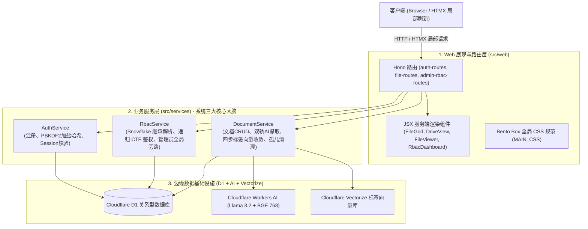
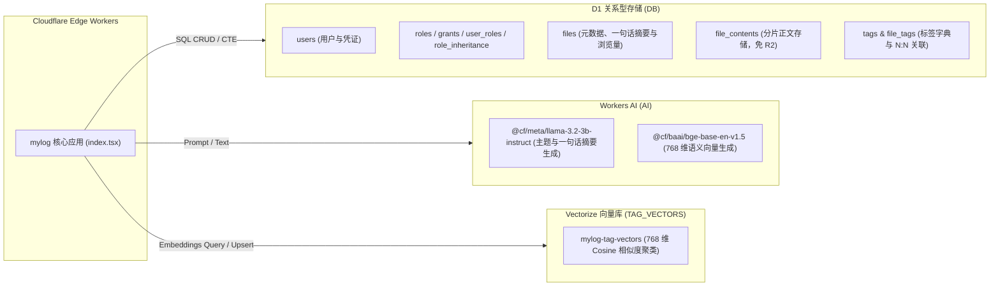
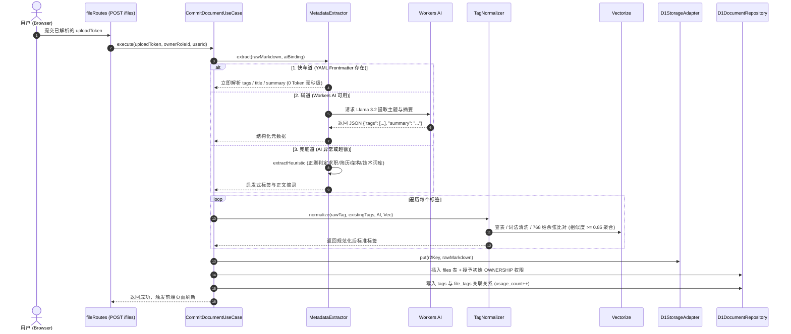
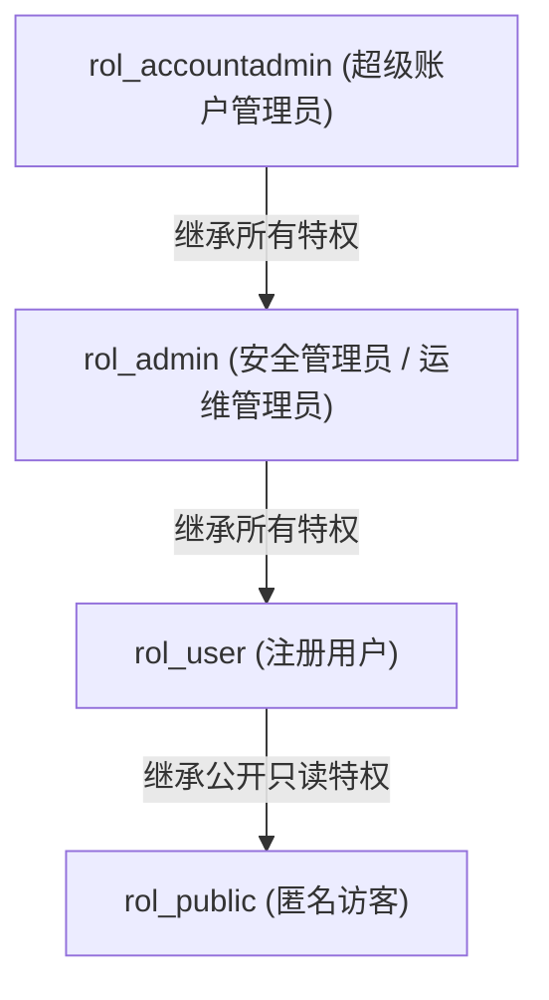

# mylog 核心业务逻辑与快速排障定位指南 (v1.1.0)

> 本文档面向系统维护者、架构师及二次开发者，旨在彻底阐明系统的全景业务链路、DDD 分层架构、基础设施三驾马车（D1 + Vectorize + Workers AI）的工作机制，并提供一套可在 **1 分钟内定位线上故障** 的实战排障手册。

---

## 目录
1. [系统全景与技术栈总览](#一系统全景与技术栈总览)
2. [六边形架构与 DDD 模块全景](#二六边形架构与-ddd-模块全景)
3. [边缘数据基础设施三驾马车 (D1 + Vectorize + Workers AI)](#三边缘数据基础设施三驾马车-d1--vectorize--workers-ai)
4. [核心业务生命周期与数据链路](#四核心业务生命周期与数据链路)
   - 4.1 [文档摄取与双轨元数据提取 (Frontmatter + AI + 启发式)](#41-文档摄取与双轨元数据提取)
   - 4.2 [四步标签防膨胀收敛引擎 (Anti-Tag-Explosion Engine)](#42-四步标签防膨胀收敛引擎)
   - 4.3 [单篇沉浸阅读与浏览量统计流](#43-单篇沉浸阅读与浏览量统计流)
   - 4.4 [文档安全删除与级联清理流](#44-文档安全删除与级联清理流)
5. [Snowflake RBAC 权限体系与递归 CTE 算法](#五snowflake-rbac-权限体系与递归-cte-算法)
6. [扁平标签化 Web 界面与 HTMX 极速交互](#六扁平标签化-web-界面与-htmx-极速交互)
7. [全量 HTTP/HTMX 接口契约清单](#七全量-httphttps-接口契约清单)
8. [极速故障定位与排障手册 (Troubleshooting Playbook)](#八极速故障定位与排障手册-troubleshooting-playbook)
   - 8.1 [三步故障定位法 (Three-Step Diagnostic)](#81-三步故障定位法)
   - 8.2 [全栈健康诊断探针 (`/api/health-infra`)](#82-全栈健康诊断探针)
   - 8.3 [十大常见故障与秒级修复方案 (Known Traps & Fixes)](#83-十大常见故障与秒级修复方案)

---

## 一、系统全景与技术栈总览

`mylog` 是一套完全基于 **Cloudflare 边缘全球计算网格 (Workers Ecosystem)** 构建的高性能个人知识库与技术文档中心。项目摒弃了传统的集中式服务器与外部依赖，利用 Cloudflare 免费配额实现了 **0 外部云依赖、0 信用卡绑定** 的高可用 Serverless 架构。

### 核心技术栈矩阵

| 维度 | 选型技术 | 核心职责与优势 |
| :--- | :--- | :--- |
| **运行时 (Runtime)** | Cloudflare Workers (V8 V8 Isolates) | 全球 300+ 边缘节点毫秒级就近冷启动 (<5ms) |
| **Web 框架** | Hono v4 + JSX (SSR) | 轻量型极速 Web 路由，边缘端服务端渲染 HTML 片段 |
| **前端交互** | HTMX v1.9 + 原生 Vanilla CSS | 声明式异步无刷新局部渲染，零 Node.js 重型前端打包体 |
| **关系型主数据库** | Cloudflare D1 (SQLite) | 存储用户、RBAC 关系、文档元数据、标签与文本内容 |
| **向量数据库** | Cloudflare Vectorize | 768 维 Cosine 向量检索，用于标签语义聚类与防膨胀 |
| **边缘智能认知** | Cloudflare Workers AI | 运行 Llama 3.2 3B 文本理解与 BAAI BGE 768 维嵌入向量 |
| **权限控制模型** | Snowflake 风格的 RBAC | 支持多角色继承图谱、递归 CTE 快速推导与细粒度特权控制 |

---

## 二、经典三层服务架构与 HDA 组件全景

项目采用 **经典三层服务架构（Route ➔ Service ➔ Database）** 与 **超媒体驱动组件架构（HDA / HTMX + SSR JSX）**，彻底剔除了重型 DDD 的冗余层级与中间商，直观高效：



### 源码目录职能映射表 (极简 18 文件)

```text
src/
├── core/
│   └── types.ts                      # 全局 Bindings, Session 与 AppServices 强类型定义
├── index.tsx                         # 应用根入口：中间件注入 3 个服务 + /api/health-infra 探针
├── services/                         # ⭐ 系统三大核心大脑
│   ├── auth-service.ts               # 用户注册、PBKDF2 加盐哈希、Session 校验
│   ├── rbac-service.ts               # Snowflake 继承解析、递归 CTE 鉴权、管理员全局旁路
│   └── document-service.ts           # 文档全生命周期 (CRUD + 双轨元数据 + 4步标签收敛 + 孤儿清理)
└── web/                              # Web 交付终端
    ├── middleware/
    │   └── auth-middleware.ts        # 登录态拦截与重定向
    ├── routes/                       # 仅保留 3 个业务路由
    │   ├── auth-routes.tsx           # 登录 / 注册 / 登出
    │   ├── file-routes.tsx           # 知识库主舞台、搜索、阅读、上传预览、删除
    │   └── admin-rbac-routes.tsx     # RBAC 权限管理控制面板
    ├── styles/                       # Bento 样式表 (css.ts, main.css)
    └── views/                        # JSX 服务端渲染组件 (HDA / HTMX)
        ├── layout.tsx
        ├── drive-view.tsx            # Bento 网格整页视图
        ├── auth-views.tsx
        ├── admin/
        │   └── RbacDashboardView.tsx
        └── components/
            ├── FileGrid.tsx          # 卡片网格局部组件 (带删除按钮)
            ├── FileViewer.tsx        # 沉浸式阅读器与 TOC
            └── UploadModal.tsx       # 干净的单步上传入库模态框
```

---

## 三、边缘数据基础设施三驾马车 (D1 + Vectorize + Workers AI)

系统将 Cloudflare 的三项核心边缘服务通过 `wrangler.toml` 绑定并协同运作：



### 3.1 D1 关系型数据库结构 (Migrations 0001 - 0006)

数据库共包含 10 张核心关系表：

1. **`users`**：存储用户账号、PBKDF2 加盐哈希密码与状态；
2. **`roles`**：系统与自定义角色定义（包含 `rol_accountadmin`, `rol_admin`, `rol_user`, `rol_public`）；
3. **`user_roles`**：用户与角色的多对多绑定；
4. **`role_inheritance`**：角色继承父子拓扑有向图（支持多层传递）；
5. **`grants`**：细粒度授权表（`role_id` + `object_id` + `privilege`）；
6. **`categories`**：扁平与树形分类定义；
7. **`files`**：文档元数据，包含 `title`, `r2_key`, `views`, `ai_summary`, `owner_role_id`, `is_public`；
8. **`file_contents`**：存储原始 Markdown 文本（作为无信用卡绑定时的存储适配方案，取代 AWS S3/R2）；
9. **`tags`**：全局标签主字典表，包含 `id`, `name`, `canonical_id` (别名重定向), `usage_count` (引用计数)；
10. **`file_tags`**：文档与标签的高效 N:N 联合索引表（带级联删除 `ON DELETE CASCADE`）。

### 3.2 Workers AI 模型绑定细节

在 `wrangler.toml` 中通过 `[ai] binding = "AI"` 绑定：
- **语义嵌入模型**：`@cf/baai/bge-base-en-v1.5`
  - 输出维度：**768 维** Float32 向量。
  - 特性：兼具极佳的中文与英文多语言语义表征能力，专用于标签聚类比对。
- **结构化生成模型**：`@cf/meta/llama-3.2-3b-instruct` (主力) / `@cf/meta/llama-3.1-8b-instruct-fp8` (后备)
  - 任务：根据文档前 1500 字内容，提取文档本质主题标签与 30~50 字精炼摘要。

### 3.3 Vectorize 向量索引规范

在 `wrangler.toml` 中配置：
```toml
[[vectorize]]
binding = "TAG_VECTORS"
index_name = "mylog-tag-vectors"
```
- 索引维度：**768**；
- 度量算法：**Cosine (余弦相似度)**；
- 命名空间：`tags`；
- **异步写入特性**：调用 `TAG_VECTORS.upsert()` 后立即返回 `{ mutationId: string }`，底层由 Cloudflare 异步排队入库，30~60 秒内在后台构建索引完成。

---

## 四、核心业务生命周期与数据链路

### 4.1 文档摄取与双轨元数据提取

当用户通过上传窗口提交 Markdown 文件时，进入 `CommitDocumentUseCase`：



### 4.2 四步标签防膨胀收敛引擎

知识库随着时间推移极易产生标签碎片化（如 `k8s`、`Kubernetes`、`k8s运维` 混杂）。系统通过 `TagNormalizer` 的 **四级漏斗过滤法** 实现全自动收敛：

```mermaid
graph TD
    InputTag["原始输入标签 (例: '#TypeScript_2026')"] --> Step1["第 1 步: 词法清洗 (cleanLexical)<br/>剥离 #, 空格/下划线转中横线, 转小写, 截断30字"]
    Step1 -->|得到 'typescript-2026'| Step2{"第 2 步: 权威别名快速字典 (SYNONYM_MAP)<br/>0ms 查表: k8s->k8s, ts->typescript, db->数据库"}
    Step2 -->|命中字典| Merged1["收敛至字典主词 (isMerged: true)"]
    Step2 -->|未命中| Step3{"第 3 步: 现有标签大小写精确命中<br/>existingTags 比对"}
    Step3 -->|已存在相同标签| MatchedExisting["直接复用现有标签"]
    Step3 -->|不存在| Step4{"第 4 步: Cloudflare Vectorize 语义比对<br/>调用 BGE 生成 768 维向量, query(topK=1)"}
    Step4 -->|余弦相似度 >= 0.85| Merged2["自动归并入云端近义标签 (isMerged: true)"]
    Step4 -->|相似度 < 0.85 (新知识领域)| UpsertVec["作为新主标签写入 Vectorize 索引<br/>upsert([{ id: cleaned, values: vector }])"]
```

### 4.3 单篇沉浸阅读与浏览量统计流

1. 用户点击卡片进入 `/files/:id`；
2. `GetDocumentUseCase` 调用 `CheckPermissionUseCase` 鉴权（验证当前用户或访客是否有 `READ` 权限）；
3. 权限核验通过后，异步触发 `docRepo.incrementViews(id)`（采用原子 `UPDATE files SET views = views + 1 WHERE id = ?`）；
4. Markdown 解析引擎解析标题层级，动态构建右侧 Sticky 交互式 **目录树 (TOC)**；
5. 服务端将高亮样式与渲染后 HTML 聚合输出，呈现极简纯净的沉浸式阅读界面。

### 4.4 文档安全删除与级联清理流

1. 用户在卡片上点击右上角垃圾桶图标，或在阅读页点击删除按钮；
2. 前端触发 HTMX 请求：`DELETE /files/:id`；
3. `DeleteDocumentUseCase` 校验调用者是否具备该文档的 `DELETE` 或 `OWNERSHIP` 权限（注：`rol_accountadmin` / `rol_admin` 拥有全局旁路放行）；
4. 确认后执行级联删除事务：
   - 级联删除 `grants` 中关于该文档的对象授权；
   - 级联删除 `file_tags` 中该文档的标签绑定（底层触发 SQLite 外键级联）；
   - 自动清理孤儿标签 (Orphaned Tags Cleanup)：物理清除所有在 `file_tags` 中不再被任何文档关联的标签记录；
   - 自动重新校准存量标签的真实引用计数 (`usage_count`)；
   - 从 `file_contents` 物理删除正文数据；
   - 从 `securable_objects` 和 `files` 表删除该条文档记录；
5. 返回状态码 `200`，HTMX 重新渲染更新后的 Bento 知识库主舞台与标签墙，若已无关联文档，相应标签即刻消失。

---

## 五、Snowflake RBAC 权限体系与递归 CTE 算法

系统采用了工业级 **Snowflake 权限拓扑模型**。核心特征是：**特权授予角色 (Grants to Roles)，角色多重赋给用户 (Roles to Users)，角色之间支持多级继承 (Role Inheritance)**。

### 5.1 默认系统角色继承图谱



### 5.2 递归 CTE 权限评估 SQL 实现

在 `D1RbacRepository.hasPrivilege` 中，系统使用单条 SQLite 递归查询完成多层继承关系展开与权限裁决，避免了多次数据库往返：

```sql
WITH RECURSIVE user_effective_roles AS (
  -- 1. 基础项：用户直接拥有的角色
  SELECT role_id FROM user_roles WHERE user_id = ?
  UNION
  -- 2. 递归项：根据 role_inheritance 展开继承的子角色
  SELECT ri.child_role_id
  FROM role_inheritance ri
  JOIN user_effective_roles uer ON ri.parent_role_id = uer.role_id
)
-- 判定规则 1: 超级管理员 (rol_accountadmin 或 rol_admin) 拥有全量特权 (全局旁路放行)
SELECT 1 AS allowed
FROM user_effective_roles
WHERE role_id IN ('rol_accountadmin', 'rol_admin')

UNION

-- 判定规则 2: 对象显式授权或具备 OWNERSHIP 特权
SELECT 1 AS allowed
FROM grants g
WHERE g.object_id = ?
  AND (g.privilege = ? OR g.privilege = 'OWNERSHIP')
  AND g.role_id IN (SELECT role_id FROM user_effective_roles)

UNION

-- 判定规则 3: 文档被标记为公开且请求特权为 READ
SELECT 1 AS allowed
FROM files f
WHERE f.id = ? AND f.is_public = 1 AND ? = 'READ'
LIMIT 1;
```

---

## 六、扁平标签化 Web 界面与 HTMX 极速交互

在系统的最新演进中，**移除了层级分类菜单与上传时强制选择分类的繁琐操作**，转而全面拥抱 **现代化扁平标签网络 (Flat Tag-Centric Graph)**：

1. **顶部搜索中枢**：支持键入触发防抖（250ms）实时向 `/files` 发送 HTMX 搜索，动态联动当前选中的 `tag` 与 `sort` 参数；
2. **热门标签胶囊横向墙 (Tags Ribbon)**：展示知识库中最活跃的标签与文档数，支持一键切换与取消筛选；
3. **Bento Box 非对称网格**：
   - 每组第 1 张与第 5 张卡片渲染为跨 2 列的 **Hero 卡片**；
   - 第 4 张卡片渲染为横向宽版 **Wide 卡片**；
   - 其余卡片为精致正方形 **Square 卡片**；
4. **一键快捷删除**：登录用户在卡片右上角可见快速删除按钮，点击直接发送 `hx-delete`，无需跳转即可瞬时移除文档。

---

## 七、全量 HTTP/HTMX 接口契约清单

### 7.1 认证与会话模块 (Auth Routes)

| 路径 | 方法 | 权限 | 请求参数 / Body | 响应类型 | 业务职能 |
| :--- | :--- | :--- | :--- | :--- | :--- |
| `/login` | `GET` | 公开 | - | `HTML` | 渲染极客暗黑登录界面 |
| `/login` | `POST` | 公开 | `username`, `password` (Form) | `302 / HTML` | 验证凭证并下发 `mylog_session` Cookie |
| `/register` | `GET` | 公开 | - | `HTML` | 渲染新用户注册页 |
| `/register` | `POST` | 公开 | `username`, `password` (Form) | `302 / HTML` | 创建用户并默认授予 `rol_user` 角色 |
| `/logout` | `GET` | 会话 | - | `302` | 清除 Session Cookie 并重定向主页 |

### 7.2 文档知识库模块 (File Routes)

| 路径 | 方法 | 权限 | 请求参数 / Body | 响应类型 | 业务职能 |
| :--- | :--- | :--- | :--- | :--- | :--- |
| `/` | `GET` | 公开 | `q`, `tag`, `sort` | `HTML` | 渲染 Bento 网格知识库主舞台 |
| `/files` | `GET` | 公开 | `q`, `tag`, `sort` | `HTML (片段)` | HTMX 专用：返回局部更新的卡片网格片段 |
| `/upload` | `POST` | 登录 | `file` (Multipart FormData) | `HTML (片段)` | 解析上传文档，返回预解析结果与确认模态框 |
| `/files` | `POST` | 登录 | `uploadToken`, `isPublic` (Form) | `302 / HTML` | 提交入库，触发双轨提取、标签向量收敛并持久化 |
| `/files/:id` | `GET` | READ | `id` (Path) | `HTML` | 渲染单篇沉浸式阅读器与动态 TOC 目录 |
| `/files/:id` | `DELETE` | DELETE / OWN | `id` (Path) | `200 / HTML` | 物理删除文档及关联关系，HTMX 局部淡出卡片 |

### 7.3 RBAC 权限管理中心 (Admin Routes)

| 路径 | 方法 | 权限 | 请求参数 / Body | 响应类型 | 业务职能 |
| :--- | :--- | :--- | :--- | :--- | :--- |
| `/admin/rbac` | `GET` | `rol_accountadmin` | - | `HTML` | 渲染 Snowflake RBAC 管理控制面板 |
| `/admin/rbac/roles` | `POST` | `rol_accountadmin` | `id`, `name`, `description` | `302` | 创建全新业务角色 |
| `/admin/rbac/assign` | `POST` | `rol_accountadmin` | `userId`, `roleId` | `302` | 将指定角色赋予用户 |
| `/admin/rbac/revoke` | `POST` | `rol_accountadmin` | `userId`, `roleId` | `302` | 撤销用户的指定角色绑定 |
| `/admin/rbac/grants` | `POST` | `rol_accountadmin` | `roleId`, `objectId`, `privilege` | `302` | 显式向角色授予对象特权 |
| `/admin/rbac/grants/revoke` | `POST` | `rol_accountadmin` | `grantId` | `302` | 撤销指定的授权项 |

### 7.4 基础设施与系统诊断接口 (Diagnostic Routes)

| 路径 | 方法 | 权限 | 请求参数 | 响应类型 | 业务职能 |
| :--- | :--- | :--- | :--- | :--- | :--- |
| `/api/health-infra` | `GET` | 公开 | `testMutation=true` (可选) | `JSON` | 边缘真机综合体检：联测 D1、Workers AI 与 Vectorize |

---

## 八、极速故障定位与排障手册 (Troubleshooting Playbook)

当线上发生故障（例如用户上传失败、文档删除报错、搜索无结果、AI 没有提取摘要等），**请严格按照以下步骤在 60 秒内迅速定位根因**。

### 8.1 三步故障定位法

```text
  [步骤 1: 探针体检]
  浏览器或终端请求: GET https://bigmax.dpdns.org/api/health-infra?testMutation=true
         │
         ├── 发现 D1 / AI / Vectorize 状态为 error ──> [直接定位基础设施绑定或模型异常]
         │
         └── 全项显示 healthy ──> [基础设施健康，转入步骤 2]
         │
  [步骤 2: 边缘实时日志追踪]
  本地终端执行: npx wrangler tail
  在浏览器中复现出问题的操作 (如上传文档、点击删除、搜索)
         │
         └── 捕获具体的 Error Stack、HTTP 状态码与 SQL 错误
         │
  [步骤 3: 数据库现场核验]
  本地终端执行: npx wrangler d1 execute DB --remote --command "SELECT ..."
  直接排查数据一致性 (如权限配置、标签记录、外键冲突)
```

---

### 8.2 全栈健康诊断探针 (`/api/health-infra`)

系统内置了无需停机的全栈真机探针。

**执行命令：**
```bash
curl -s "https://bigmax.dpdns.org/api/health-infra?testMutation=true" | jq .
```

**健康状态基准输出：**
```json
{
  "timestamp": "2026-09-23T02:15:30.123Z",
  "d1": {
    "status": "healthy",
    "fileCount": 8
  },
  "workersAi": {
    "status": "healthy",
    "embeddingModel": "@cf/baai/bge-base-en-v1.5",
    "vectorDimensions": 768,
    "generationModel": "@cf/meta/llama-3.2-3b-instruct",
    "generationSample": "Pong"
  },
  "vectorize": {
    "status": "healthy",
    "details": {
      "dimensions": 768,
      "metric": "cosine",
      "vectorCount": 6
    },
    "mutationTest": { "mutationId": "06cefa90-b98a-4467-beec-6948332da7b7" },
    "queryTest": { "count": 1, "matches": [...] }
  }
}
```

---

### 8.3 十大常见故障与秒级修复方案

#### 故障 1：Workers AI 报错 `5007: No such model: @cf/...`
- **症状**：上传文档时挂起或后台报错 `5007`。
- **定位**：在代码中使用了已被 Cloudflare 下架或名称不匹配的模型标识符（例如误用了旧模型 `@cf/baai/bge-base-zh` 或 `@cf/qwen/qwen1.5-7b-chat`）。
- **根治**：
  - 嵌入模型统一使用官方推荐支持的 768 维多语言模型：`@cf/baai/bge-base-en-v1.5`；
  - 文本生成模型统一使用：`@cf/meta/llama-3.2-3b-instruct`，并配置 `@cf/meta/llama-3.1-8b-instruct-fp8` 作为后备；
  - 可随时调用 `/api/health-infra` 快速校验模型名称可用性。

#### 故障 2：报错 `TypeError: rawText.match is not a function`
- **症状**：AI 提炼元数据时抛出 Unhandled Exception。
- **定位**：Cloudflare Workers AI 运行时在某些版本中会自动将 LLM 返回的 JSON 字符串反序列化为 JavaScript 对象。直接对对象调用 `.match()` 或 `.split()` 会崩溃。
- **根治**：在 `MetadataExtractor.ts` 中先检查类型：
  ```typescript
  const resp = aiResponse?.response ?? aiResponse;
  if (resp && typeof resp === 'object') {
    // 已经自动解析为对象，直接读取属性
    return { tags: resp.tags, summary: resp.summary };
  }
  // 否则执行正则截取 JSON 字符串
  ```

#### 故障 3：Vectorize 插入后 `vectorCount` 数量没有立即增加
- **症状**：调用了 `TAG_VECTORS.upsert()`，但终端 `wrangler vectorize get mylog-tag-vectors` 显示向量数未变。
- **定位**：**这是正常且符合预期的现象**。Vectorize 的数据插入与索引更新是 **异步队列处理** 的。`upsert()` 仅返回 `mutationId`，后台通常需要 30~60 秒完成落盘与索引重构。

#### 故障 4：管理员在前端点击删除文档提示 `403 权限不足`
- **症状**：登录账号即使属于 `rol_admin` 或 `rol_accountadmin`，点击删除游客或他人上传的文档依然提示无权限。
- **定位**：检查 `src/modules/iam/infrastructure/d1-rbac-repository.ts` 的 `hasPrivilege` CTE 查询。若缺少超级管理员旁路放行规则，用户仅能删除显式被授权为 `OWNERSHIP` 的文档。
- **根治**：确保 CTE 包含以下旁路逻辑：
  ```sql
  SELECT 1 AS allowed
  FROM user_effective_roles
  WHERE role_id = 'rol_admin'
  ```

#### 故障 5：本地运行 `npm run dev` 报错无法找到 Vectorize 或 Workers AI
- **症状**：本地 Miniflare 开发服务器启动后，一调用 AI 或向量检索就报错 `Cannot read properties of undefined (reading 'run')`。
- **定位**：本地模拟器无法离线模拟 Cloudflare Workers AI 神经网络计算和 Vectorize 向量索引。
- **根治**：
  - 代码中所有调用点必须包含可选链判空：`if (this.aiBinding && typeof this.aiBinding.run === 'function')`；
  - 涉及 AI 和 Vectorize 的真机联调，直接通过 `npm run deploy` 部署至线上边缘预览环境，或使用健康检查探针 `/api/health-infra` 验证。

#### 故障 6：文档内容包含单引号、特殊符号导致入库失败
- **症状**：上传某些 Markdown 文档报错 SQL Syntax Error。
- **定位**：SQL 拼接漏洞导致。
- **根治**：全局严禁字符串拼接 SQL，所有数据库交互一律使用 D1 的预编译参数绑定：
  ```typescript
  await this.db.prepare('INSERT INTO files (id, title) VALUES (?, ?)').bind(id, title).run();
  ```

#### 故障 7：上传文档后标签被归类为“知识沉淀”或无关编程语言
- **症状**：上传一份个人简历或项目总结，被强制打上死板标签或毫无关系的 `React` 标签。
- **定位**：提示词 (Prompt) 缺乏对文档本质属性的引导，或者启发式扫描器权重倾斜。
- **根治**：
  1. 提示词中明确强调：*“提炼 1~3 个最能代表文档核心本质或主题的标签（例如若为简历则提炼'简历','求职档案'；切忌盲目罗列正文中顺带提及的编程语言）”*；
  2. 启发式扫描器中加入核心体裁识别正则（如判定包含“工作经历”、“求职”则优先归类为“简历”）。

#### 故障 8：HTMX 局部请求后整个页面被重复嵌套
- **症状**：搜索或删除后，卡片容器内部竟然渲染了整个完整的 HTML 页面（包含 header 和 footer）。
- **定位**：路由未正确区分全页渲染与 HTMX 局部渲染。
- **根治**：检查 `file-routes.ts`，检测 `c.req.header('HX-Request')`。如果是 HTMX 请求，必须仅返回 `<FileGrid files={...} />` 组件片段，严禁返回 `<DriveView>` 或 `<Layout>`。

#### 故障 9：线上新增用户无法获得管理员权限
- **症状**：新注册的账号默认只有 `rol_user` 角色，无法进入 `/admin/rbac`。
- **定位**：为保障安全，系统默认不在前端开放超级管理员角色申请。
- **根治**：在本地终端通过 Wrangler 直连 D1 执行授权命令：
  ```bash
  npx wrangler d1 execute DB --remote --command "INSERT OR IGNORE INTO user_roles (user_id, role_id, granted_by, granted_at) SELECT id, 'rol_accountadmin', 'SYSTEM', strftime('%s', 'now') * 1000 FROM users WHERE username = '目标用户名';"
  ```

#### 故障 10：数据库迁移执行失败 `table already exists`
- **症状**：CI/CD 流水线执行 `wrangler d1 migrations apply` 报错退出。
- **定位**：迁移 SQL 文件中缺少幂等性保护。
- **根治**：编写迁移文件时，建表必须使用 `CREATE TABLE IF NOT EXISTS`，索引必须使用 `CREATE INDEX IF NOT EXISTS`，修改字段操作必须事先检查或在迁移脚本中做幂等封装。

---

*文档版本：v1.1.0*  
*最新修订：2026-09-23*  
*维护团队：mylog 架构与边缘运维组*
